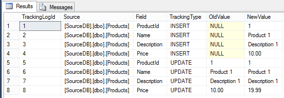
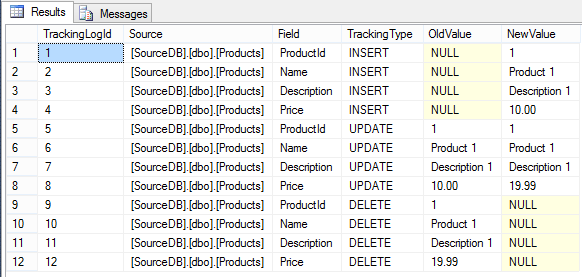

# Service Broker External Activator for SQL Server Step by Step #5 #

From the previous post, [Step 4: External Activator Service Configuration](http://devkimchi.com/951/service-broker-external-activator-for-sql-server-step-by-step-4/), we have configured Service Broker (SB) External Activator (EA). In this article, we are going to start the Service and run sme sample script to perform `INSERT`, `UPDATE` and `DELETE`.

Its sample source codes can be found at: [devkimchi/Service-Broker-External-Activator](https://github.com/devkimchi/Service-Broker-External-Activator)

> * [Step 1: Service Broker External Activator Service Setup](http://devkimchi.com/811/service-broker-external-activator-for-sql-server-step-by-step-1/)
> * [Step 2: SQL Server Setup](http://devkimchi.com/831/service-broker-external-activator-for-sql-server-step-by-step-2/)
> * [Step 3: External Activator Application Development](http://devkimchi.com/891/service-broker-external-activator-for-sql-server-step-by-step-3/)
> * [Step 4: External Activator Service Configuration](http://devkimchi.com/951/service-broker-external-activator-for-sql-server-step-by-step-4/)
> * **Step 5: Putting Them Altogether**


## External Activator Service Startup ##

We are ready to start the Service. Open Computer Management Console and start the Windows Service.


Once it's started, you will find the log at `C:\Program Files\Service Broker\External Activator\Log\EATrace.log`. The log should look like:

```
10/11/2014 9:22:58 PM	======	================================================================================
10/11/2014 9:22:58 PM	======	================================================================================
10/11/2014 9:22:58 PM	INFO	The External Activator service is starting.
10/11/2014 9:22:58 PM	INFO	Initializing configuration manager ...
10/11/2014 9:22:58 PM	INFO	Reloading configuration file C:\Program Files\Service Broker\External Activator\config\EAService.config ...
10/11/2014 9:22:58 PM	INFO	Reloading configuration file completed.
10/11/2014 9:22:58 PM	VERBOSE	Running recovery using recovery log file C:\Program Files\Service Broker\External Activator\log\EARecovery.rlog ...
10/11/2014 9:22:58 PM	VERBOSE	Running recovery completed.
10/11/2014 9:22:58 PM	INFO	Initializing configuration manager completed.
10/11/2014 9:22:58 PM	VERBOSE	Starting worker threads...
10/11/2014 9:22:58 PM	VERBOSE	Worker threads are successfully started.
10/11/2014 9:22:58 PM	INFO	The External Activator service is running.
10/11/2014 9:22:58 PM	VERBOSE	CM-NS-Thread is starting...
10/11/2014 9:22:58 PM	VERBOSE	Heartbeat-Thread is starting...
```

Now, the EA is ready to receive message from SB to process messages. Let's stop the Service and find what are logged.

```
10/11/2014 9:33:46 PM	VERBOSE	Heartbeat-Thread is exiting...
10/11/2014 9:33:46 PM	VERBOSE	Waiting for worker threads to finish...
10/11/2014 9:33:47 PM	VERBOSE	CM-NS-Thread is exiting...
10/11/2014 9:33:47 PM	VERBOSE	Worker threads have been shutdown.
10/11/2014 9:33:47 PM	INFO	The External Activator service is shutting down.
10/11/2014 9:33:47 PM	VERBOSE	Shutting down configuration manager.
10/11/2014 9:33:47 PM	VERBOSE	Checkpointing recovery log C:\Program Files\Service Broker\External Activator\log\EARecovery.rlog ...
10/11/2014 9:33:47 PM	VERBOSE	Checkpointing recovery log completed.
```

Start the service again and let's run some sampel SQL script to see the result.


## Sample SQL Scripts Run ###

### `INSERT` ###

```sql
INSERT INTO [SourceDB].[dbo].[Products] ([Name], [Description], [Price]) VALUES ('Product 1', 'Description 1', 10)
```

Firstly, run the SQL script above. As you can see, we add a product into the `Products` table. Then check the log file and you will be able to see the following:

```
10/11/2014 10:12:19 PM	VERBOSE	Received event notification for [DEVKIMCHI].[SourceDB].[dbo].[TrackingRequestQueue].
10/11/2014 10:12:20 PM	VERBOSE	Application process C:\Temp\SBEASampleApp\SBEASampleApp.exe was created: id = 9748.
10/11/2014 10:12:27 PM	VERBOSE	Application process id = 9748 has exited: exit code = 0, exit time = 11/10/2014 10:12:27 PM.
```

If the exit code is not `0`, there might be something wrong. `0` means the application runs without an error, which means the tracking details are logged onto the `TrackingLogs` table. Let's see what are logged.

```sql
SELECT * FROM [TrackingDB].[dbo].[TrackingLogs]
```

The result might look like:


### `UPDATE` ###

```sql
UPDATE [SourceDB].[dbo].[Products] SET [Price] = 19.99 WHERE ProductId = 1
```

Once the SQL query is performed, you will be able to see the following log:

```
10/11/2014 10:27:41 PM	VERBOSE	Received event notification for [DEVKIMCHI].[SourceDB].[dbo].[TrackingRequestQueue].
10/11/2014 10:27:41 PM	VERBOSE	Application process C:\Temp\SBEASampleApp\SBEASampleApp.exe was created: id = 11220.
10/11/2014 10:27:47 PM	VERBOSE	Application process id = 11220 has exited: exit code = 0, exit time = 11/10/2014 10:27:47 PM.
```

And the result of the query looks like:

```sql
SELECT * FROM [TrackingDB].[dbo].[TrackingLogs]
```




### `DELETE` ###

```sql
DELETE FROM [SourceDB].[dbo].[Products] WHERE ProductId = 1
```

After running the SQL query above, find the log file.

```
10/11/2014 10:30:20 PM	VERBOSE	Received event notification for [DEVKIMCHI].[SourceDB].[dbo].[TrackingRequestQueue].
10/11/2014 10:30:20 PM	VERBOSE	Application process C:\Temp\SBEASampleApp\SBEASampleApp.exe was created: id = 7220.
10/11/2014 10:30:26 PM	VERBOSE	Application process id = 7220 has exited: exit code = 0, exit time = 11/10/2014 10:30:26 PM.
```

Run the query again to find out log details

```sql
SELECT * FROM [TrackingDB].[dbo].[TrackingLogs]
```




---
We have run the Service with proper service account and SQL login, run `INSERT`, `UPDATE` and `DELETE` queries. As a result, the change details are properly stored.


## Conclusion ##

Service Broker provided by SQL Server gives business many benefits. As stated at the very beginning, SB is similar to Triggers, has also many differences from them. Especially, SB can run external applications through External Activator Service. This doesn't only bring a lot of flexibilities to service administrator, but also enables developers not to rely on SQL Server features. Once this is implemented properly, including error handling features, SB will be a very strong option to handle and track data changes.
